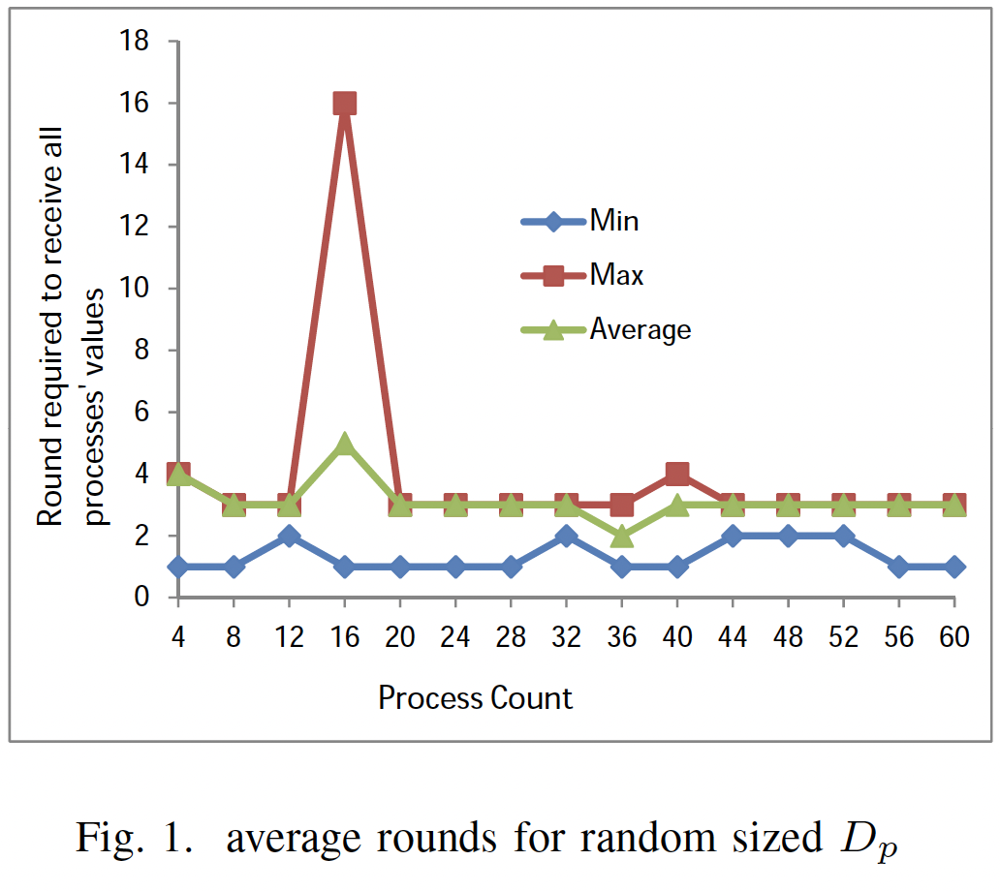
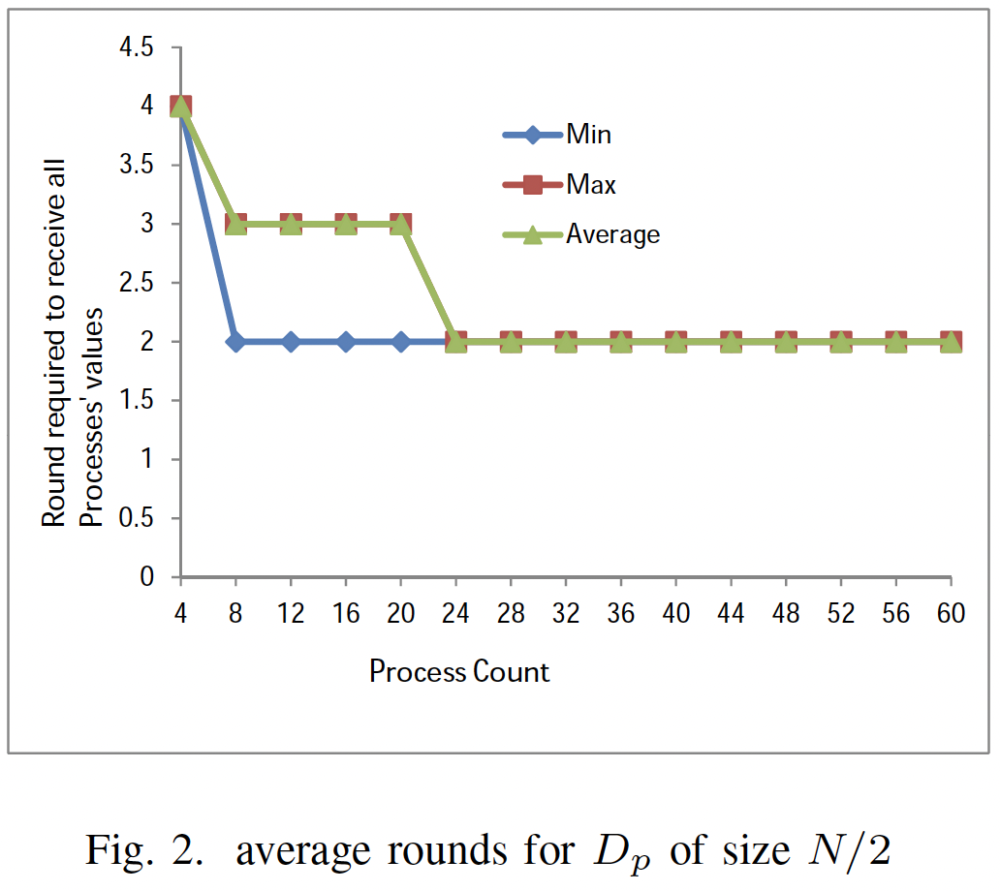
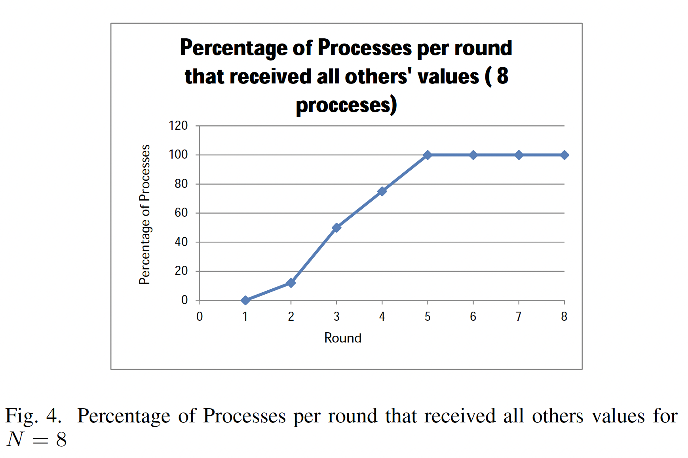
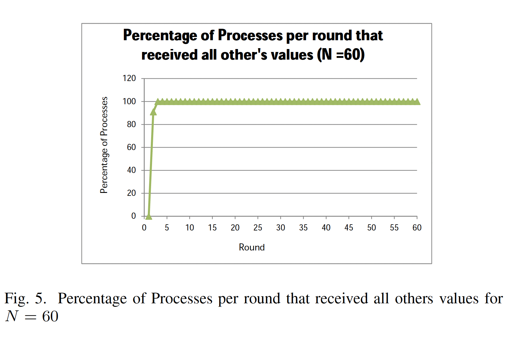
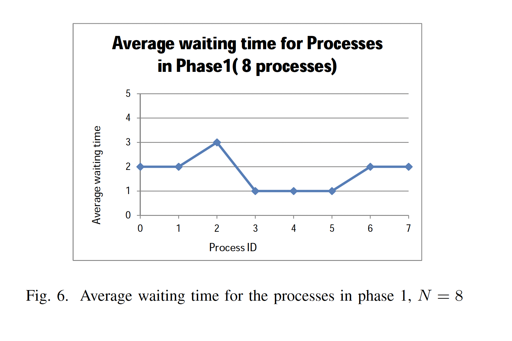
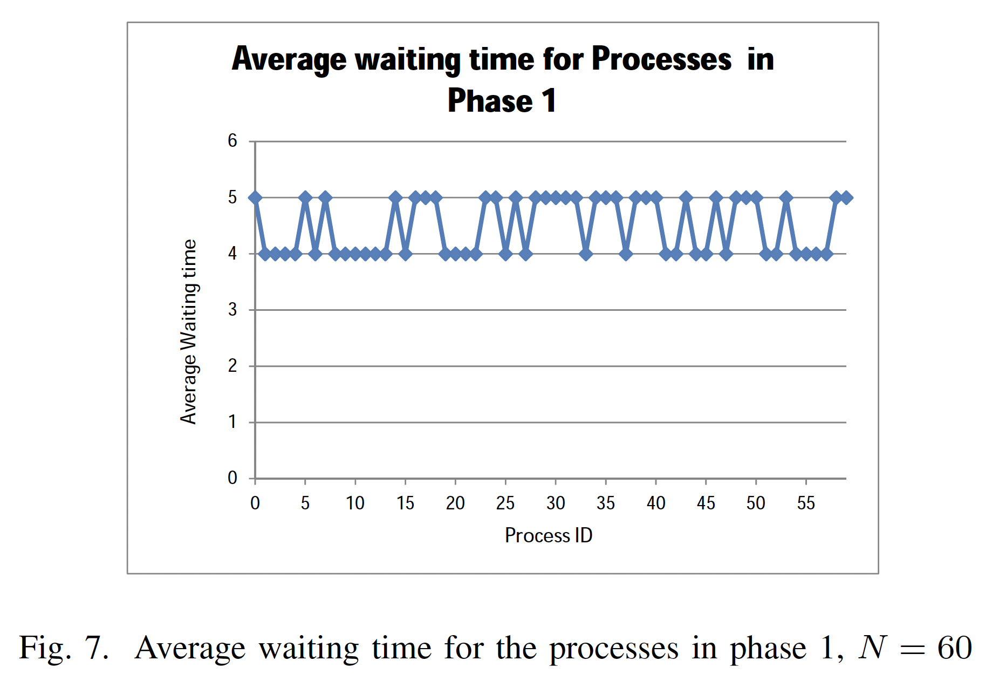

.. include:: substitutions.rst

Implementation, Results and Discussion
======================================

Implementation and Methodology
~~~~~~~~~~~~~~~~~~~~~~~~~~~~~~~~~~~~

As [Hossain]_ depicted in his research, the experiment setup is as follows:

The topology for the experiment is considered completely connected. It is assumed that the failure detector module will
not detect any other process as crashed during execution of the consensus algorithm. Therefore, the detector module in process p populates D_p randomly before consensus algorithm
starts execution. The size of D_p can be selected randomly or simply N/2 . Measurements are taken for both sized D_p.

Three parameters are measured to analyzed the performance of the algorithm:
1) The average number of round needed to receive all processs values for different number of Processes in the system. The algorithm is run for N = 4, 8, 12, ··· 60. For each value of N, we count how many rounds each process takes to receive all other processes' values and then took the average of them to get the average number of round for that particular value of N. This is done for both category of D_p.
2) For each round, the percentage of processes that get values from all other processes. In this case, N = 8 and 60 is considered to show the comparison result for the parameter.
3) Average number of waiting time for each process in phase1 for N =8 and 60. Waiting time is the number of times a presses is selected to execute but has to wait to receive all processes' values who are not in its D_p.

Results
~~~~~~~~

The first parameter, the average numbers of round required is plotted against the process count. Process count start from 4, incremented by 4 and its maximum value is 60.

The second parameter is the percentage of processes in
each round those receive values for all other processes in the
system. This parameter is plotted against the round number
which is shown in figure 4 and 5. It can be observed that in
second round, for N = 60, all processes receive all others'
values (figure 5) while for N = 8 only about 13 percent of
the processes receive all processes' values, figure 4. It takes
5 rounds to reach this percentage to 100, which supports the
results shown in figure 1 and 2, meaning that higher number
of processes in system less number of round required because
of higher connectivity.

The last parameter is the average waiting time for the
processes in phase1. The waiting time is plotted against the
process IDs for N = 8 and 60. The graphs are shown in figure
6 and 7.

Discussion
~~~~~~~~~~

The performance of the Chandra-Toueg algorithm heavily relies on the effectiveness of the underlying failure detector. The experiments presented validate the algorithm's robustness and adaptability to network conditions and system sizes, demonstrating its scalability and efficiency. However, the dependency on a highly accurate failure detector poses a limitation, especially in dynamic or unstable network environments where the accuracy of failure detection might be compromised. While the Chandra-Toueg algorithm is suitable for scenarios where the reliability of the failure detector can be assured, alternative algorithms such as Bracha-Toueg offer solutions that do not rely on failure detectors. Choosing between these algorithms should be guided by the specific requirements and constraints of the application environment, including factors such as network stability, the criticality of consensus accuracy, and the overhead of managing failure detectors.

.. [Hossain] Hossain, Md Amjad. "Performance Analysis of Chandra-Toueg Consensus Algorithm with S Failure Detector." Department of Computer Science, Kent State University, OH. Email: mhossai2@kent.edu.